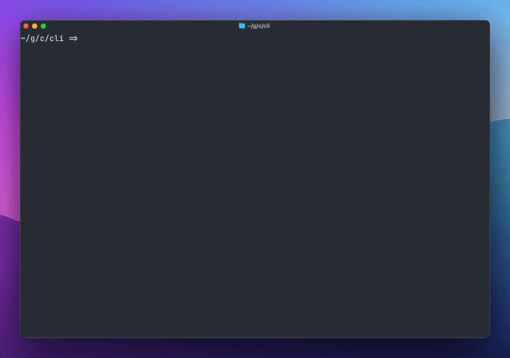

# Friday CLI

The Friday CLI (`friday`) is a customizable command line coding agent.



## Installation

**macOS / Linux:**

```bash
curl -fsSL https://raw.githubusercontent.com/friday-ai/friday/main/extensions/cli/scripts/install.sh | bash
```

**Windows (PowerShell):**

```powershell
irm https://raw.githubusercontent.com/friday-ai/friday/main/extensions/cli/scripts/install.ps1 | iex
```

Or install with npm if you have Node.js 20+:

```bash
npm i -g @friday-ai/cli
```

## Usage

```bash
friday
```

### Headless Mode

Headless mode (`-p` flag) runs without an interactive terminal UI, making it perfect for:

- Scripts and automation
- CI/CD pipelines
- Docker containers
- VSCode/IntelliJ extension integration
- Environments without a TTY

```bash
# Basic usage
friday -p "Generate a conventional commit name for the current git changes."

# With piped input
echo "Review this code" | friday -p

# JSON output for scripting
friday -p "Analyze the code" --format json

# Silent mode (strips thinking tags)
friday -p "Write a README" --silent
```

**TTY-less Environments**: Headless mode is designed to work in environments without a terminal (TTY), such as when called from VSCode/IntelliJ extensions using terminal commands. The CLI will not attempt to read stdin or initialize the interactive UI when running in headless mode with a supplied prompt.

### Session Management

The CLI automatically saves your chat history for each terminal session. You can resume where you left off:

```bash
# Resume the last session in this terminal
friday --resume

# List recent sessions and choose one to resume
friday ls

# List sessions in JSON format (for scripting)
friday ls --json
```

## Command Line Options

- `-p`: Run in headless mode (no TUI)
- `--config <path>`: Specify agent configuration path
- `--resume`: Resume the last session for this terminal
- `<prompt>`: Optional prompt to start with

## Environment Variables

- `FRIDAY_CLI_DISABLE_COMMIT_SIGNATURE`: Disable adding the Friday commit signature to generated commit messages
- `FORCE_NO_TTY`: Force TTY-less mode, prevents stdin reading (useful for testing and automation)

## Commands

- `friday`: Start an interactive chat session
- `friday ls`: List recent sessions with TUI selector to choose one to resume
- `friday login`: Authenticate with Friday
- `friday logout`: Sign out of current session
- `friday remote`: Launch a remote instance
- `friday serve`: Start HTTP server mode

### Session Listing (`friday ls`)

Shows recent sessions, limited by screen height to ensure it fits on your terminal.

- `--json`: Output in JSON format for scripting (always shows 10 sessions)

## TTY-less Support

The CLI fully supports running in environments without a TTY (terminal):

```bash
# From Docker without TTY allocation
docker run --rm my-image friday -p "Generate docs"

# From CI/CD pipeline
friday -p "Review changes" --format json

# From VSCode/IntelliJ extension terminal tool
friday -p "Analyze code" --silent
```

The CLI automatically detects TTY-less environments and adjusts its behavior:

- Skips stdin reading when a prompt is supplied
- Disables interactive UI components
- Ensures clean stdout/stderr output

For more details, see [`spec/tty-less-support.md`](./spec/tty-less-support.md).
