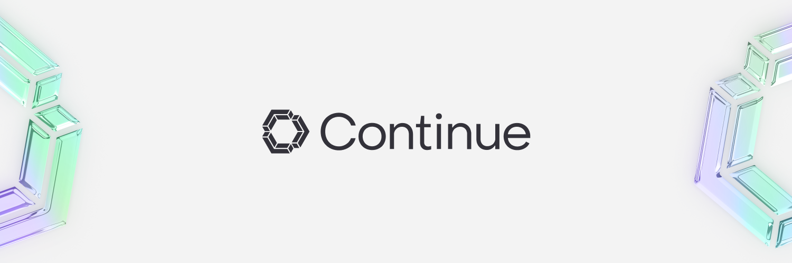

 

# Friday AI / IronHero

**🚀 开源 AI 编程助手 | 本地优先 · 隐私至上**  
**🚀 Open-Source AI Code Assistant | Local-First · Privacy-First**

 

---

## 简介 / Introduction

Friday AI 将强大的 AI 编程能力直接嵌入你的 IDE，让你完全掌控数据和模型选择。  
支持 OpenAI、Anthropic、Ollama 等主流模型，以及任意兼容 API，自带 Key 无需云账号。

Friday AI brings powerful AI coding directly into your IDE with full data control.  
BYOK — works with OpenAI, Anthropic, Ollama, and any API-compatible model. No cloud account required.

---

## ✨ 核心特性 / Features

| 功能 | 说明 |
|---|---|
| 💬 **AI 对话 / Chat** | 与 AI 自由对话，理解代码、回答疑问 |
| ⌨️ **代码补全 / Autocomplete** | 行内智能代码建议，支持 FIM (Fill-in-the-Middle) |
| ✏️ **代码编辑 / Edit** | 自然语言描述修改，无需离开当前文件 |
| 📎 **上下文感知 / Context** | 自动感知项目结构、当前文件、选中的代码 |
| 🏠 **本地优先 / Local-First** | 数据不出本地，隐私至上 |

---

## 快速开始 / Quick Start

1. 安装插件 / Install the extension
2. 点击侧边栏 Friday 图标 / Click the Friday icon in the sidebar
3. 配置模型（支持 OpenAI / Anthropic / Ollama / 自定义兼容 API）/ Configure your model
4. 开始对话或使用 `Ctrl+L` 选中代码 / Start chatting or select code with `Ctrl+L`

---

## 功能预览 / Feature Preview

### 💬 对话模式 / Chat Mode
与 AI 自由对话，理解代码、生成文档、分析问题。  
Chat freely with AI — understand code, generate docs, analyze problems.

### ✏️ 编辑模式 / Edit Mode
选中代码后用自然语言描述修改意图，AI 直接编辑。  
Select code, describe the change in natural language, AI edits directly.

### ⌨️ 自动补全 / Autocomplete
输入时自动提供行内代码建议，支持 Tab 补全。  
Inline code suggestions as you type, press Tab to accept.

### 🤖 Agent 模式 / Agent Mode
AI 自主完成多步骤开发任务。  
AI autonomously completes multi-step development tasks.

---

## 模型支持 / Supported Models

- **OpenAI** (GPT-4o, GPT-4, GPT-3.5)
- **Anthropic** (Claude Sonnet, Claude Opus, Claude Haiku)
- **Ollama** (本地部署 Llama, Mistral, Qwen, DeepSeek 等)
- **Mistral** (Codestral, Mistral Large)
- **Google Gemini**
- **Azure OpenAI**
- **OpenRouter**
- **自定义兼容 API / Custom Compatible API** — 任意 OpenAI/Anthropic 兼容端点

---

## License

[Apache 2.0 © 2023-2025 IronHero](./LICENSE)
